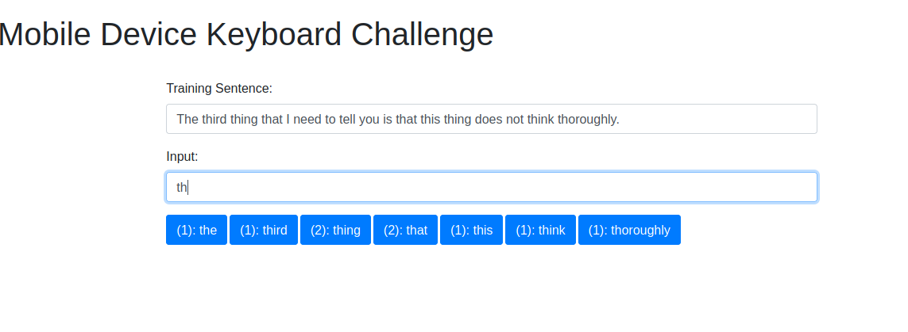

# asymmetrik

## Mobile Device Keyboard Challenge

We are developing a keyboard autocomplete algorithm to be used in various mobile devices. This algorithm will analyze the passages typed by the user in order to suggest a set of candidate autocomplete words given a word fragment.

We need you to write the algorithm that will learn the words typed by the user over time and then determine a ranked list of autocomplete candidates given a word fragment (you should ignore capitalization when providing suggestions). The algorithm will be trained in an online manner, meaning that additional training passages can be submitted and incorporated into the algorithm at the same time as the algorithm is being used to provide autocomplete suggestions. Ideally, the accuracy of the algorithm will improve over time as more and more training passages are incorporated. Due to the deployment environment for this algorithm, efficiency is critical. The data structure utilized by your algorithm should be optimized for space and time.

For the challenge, we need you to build a command line interface or graphical user interface that allows the interactive entry of training text and also allows the user to provide word fragments and get autocomplete suggestions in return. We have provided you with an interface specification [1] that we’d like you to implement, as well as a sample passage [2] and example inputs and outputs.

```
[1] Interface Specification

Candidate
    String getWord() : returns the autocomplete candidate
    Integer getConfidence() : returns the confidence* for the candidate

AutocompleteProvider
    List<Candidate> getWords(String fragment) : returns list of candidates ordered by confidence*
    void train(String passage) : trains the algorithm with the provided passage

* Confidence is the likelihood/relevance of an individual word relative to the other words being returned by the autocomplete provider. If two words are equally likely, they should have the same confidence. If one is more likely, it should have a higher confidence.
[2] Example words and their expected next words based on the provided passages

Train: "The third thing that I need to tell you is that this thing does not think thoroughly."
Input: "thi" --> "thing" (2), "think" (1), "third" (1), "this" (1)
Input: "nee" --> "need" (1)
Input: "th" --> "that" (2), "thing" (2), "think" (1), "this" (1), "third" (1), "the" (1), "thoroughly" (1)

```

- ### Language: HTML/JS
- ### To run, open the '.html' file in your favorite browser.
- ### Plain Javascript was chosen to minimize packages that would need to be installed as opposed to React or Angular. Bootstrap was linked to provide a basic template.
- ### As you type the input Text, suggestions will pop up below the typing area.


